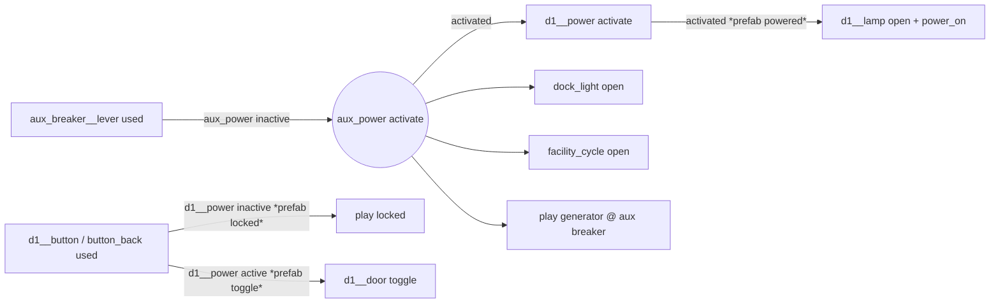
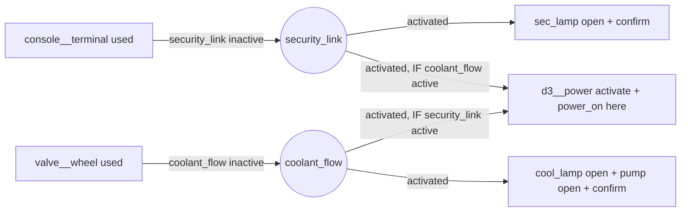

# Night Shift -- state graph

Every piece of Night Shift's game logic, as X7 bindings (events ->
conditions -> actions) plus one Lua hook. Names are placed IDs without the
`nightshift:entity/` prefix; `x__y` is prefab instance `x`'s child `y`.
Bindings marked *(prefab)* are authored once in `nightshift.facility` and
copied per instance at load. The engine prints the compiled set with
`megamod-resources --bundle DIR --world night_shift` and traces it live
with `megamod-match --trace-events`.

Totals: **59 bindings** (27 the world's, 32 from prefabs), **33
conditions** (26 `relay_state`, 7 `mover_state`), **108 actions** (52
`play_sound`, 18 `open`, 12 `close`, 9 `activate`, 8 `damage`, 6 `toggle`,
1 each `deactivate`, `teleport`, `use`). All six X7 events, both
conditions and all nine actions are used.

## 1. Auxiliary power



- `aux_on`: `aux_breaker__lever used` if `aux_power inactive` -> activate `aux_power`
- `aux_live`: `aux_power activated` -> activate `d1__power`; open `dock_light__light`; open `facility_cycle`; sound `generator`
- *(prefab)* `security_door`: `locked`, `locked_back` (button used, own power inactive -> `locked`),
  `toggle`, `toggle_back` (own power active -> toggle `door`), `powered` (power activated -> open `lamp`, `power_on`),
  `unpowered` (power deactivated -> close `lamp`, close `door`, `power_down`)
- *(prefab)* `breaker_panel.clunk`: lever used -> `click`

The lift (`lift__*`) and D3 run the same six prefab bindings; before they
have power they only buzz.

## 2. Research access: an AND of two relays



X7 has no AND node; two bindings, each conditioned on the other relay,
make one: whichever subsystem comes second powers D3 (`sec_research`,
`cool_research`). Exactly one fires (asserted: `d3__power activated` once).

## 3. Timers made of movers

X7 has no timer. Three movers are clocks:

- **`facility_cycle`** (a hidden mover definition inside the generator,
  0.5 wu at 0.125 wu/s = 4 s a swing) -- the plant's heartbeat:
  `cycle_turn` (opened -> close), `cycle_rearm` (closed, if `aux_power`
  active -> open). While `lockdown` is inactive, `plant_hum` (opened) plays
  `machinery` at the generator and the core. While it is active, `klaxon`
  (opened) and `klaxon_back` (closed) play `alarm` at three red beacons and
  at D1, and `klaxon` fires both steam vents.
- **The core's rise** (0.5 wu at 0.3 wu/s) delays the lockdown 1.7 s after
  the use: `data_core.unlatch` *(prefab)* (socket used, if `core` closed ->
  open `core`, `core_release`), then the world's `extract` (`core__core
  opened` -> activate `lockdown`).
- **The pump** oscillates on its own travel: `pump.stroke` *(prefab)*
  (piston opened -> close, `pump` thump), `pump_run` (piston closed, if
  `coolant_flow` active -> open).

## 4. Hazards

- `shock_a`, `shock_b`: `puddle_a|b entered` -> damage 20 to the actor, `shock`.
- *(prefab)* `steam_vent`: `vent` (plume opened -> close it, `steam`);
  `scald_opening`, `scald_open`, `scald_closing` (zone entered, if the
  plume is in that phase -> damage 30, `steam`). Three bindings because
  conditions have no OR/NOT ("plume not closed").

Damage goes through the native pipeline (`hta_game_hurt`) to the event's
actor only; asserted: the player who stepped in is hurt once, the other
is not.

## 5. Things in the dark

- `passage_bang`: `passage_stinger entered` if `aux_power` inactive -> `distant_bang` at D3 (21 wu away: quiet)
- `knock`: `corridor_stinger entered` if `d3__power` inactive -> `knock` at D3's door
- `followed`: `tunnel_stinger entered` if `lockdown` active -> `knock` at the core shutter, `distant_bang` at the core
- `cold_spot`: `cold_spot entered` -> **use** `cold_spot_hook` (-> Lua `on_used(hook, actor)`)
- `stir`: `anomaly activated` -> `anomaly` at the cold spot and at the holding cell

Lua (`nightshift:script/anomaly`): `game.near(actor, 5)` non-empty -> on
the first visit only, activate `anomaly`; alone -> (at most twice a round)
activate `anomaly` and `teleport` the actor to `holding_cell`.

## 6. Lockdown

```mermaid
flowchart TD
  U[core__socket used] -->|core closed *prefab unlatch*| R[core open, core_release]
  R -.1.7 s later.-> O[core__core opened]
  O --> LK((lockdown activate))
  LK --> A1[deactivate d1__power -> d1 lamp off, d1 door closes, power_down]
  LK --> A2[close d3__door]
  LK --> A3[close dock_light]
  LK --> A4[alarm at the core]
  LK --> A5[open shutter_core, shutter_dock]
  LK --> A6[open 3 red beacons]
  LK -.heartbeat.-> A7[klaxons every 4 s, steam vents every 8 s]
```

`lockdown_seal` and `lockdown_routes` (two bindings on the same event: a
binding holds at most 8 actions). One core press causes, in its root
cascade, 4 + 5 + 3 (`unpowered`) actions; the heartbeat adds a new root
every 4 s. Measured worst step of the escalation: 1.8 us (desktop).

## 7. Exit

- `lift_power`: `lift_breaker__lever used` if `lift__power` inactive -> activate `lift__power`
  (-> *(prefab)* `powered`: the lift lamp, `power_on`)
- `ride`: `lift_car entered` -> teleport the actor to `surface`; activate `shift_complete`; `lift` at the surface
- `shift_over`: `shift_complete activated` -> `shift_over` at the surface

## What a trace looks like

`megamod-match --trace-events` on the test's run (`scratch/night_shift/host.log`, abridged, real lines):

```
[bind] step 7814: event nightshift:entity/core__core opened (depth 1)
[bind]   binding extract: action activate nightshift:entity/lockdown queued
[bind]   dispatch activate -> nightshift:entity/lockdown (binding extract)
[bind] step 7815: event nightshift:entity/lockdown activated (depth 2)
[bind]   binding lockdown_routes: action open nightshift:entity/shutter_core__shutter queued
[bind]   binding lockdown_seal: action deactivate nightshift:entity/d1__power queued
[bind] step 7815: event nightshift:entity/d1__power deactivated (depth 3)
[bind]   nightshift:prefab/security_door binding unpowered (d1): action close nightshift:entity/d1__door queued
```

The core's `opened` is a new root with no actor (X7: `opened`/`closed`
never carry one), so nothing in the lockdown may `damage` or `teleport`
-- the loader would refuse it. The escalation completes in the step after
the core arrives. Bindings run in canonical ID order, so `lockdown_routes`
queues before `lockdown_seal`.
